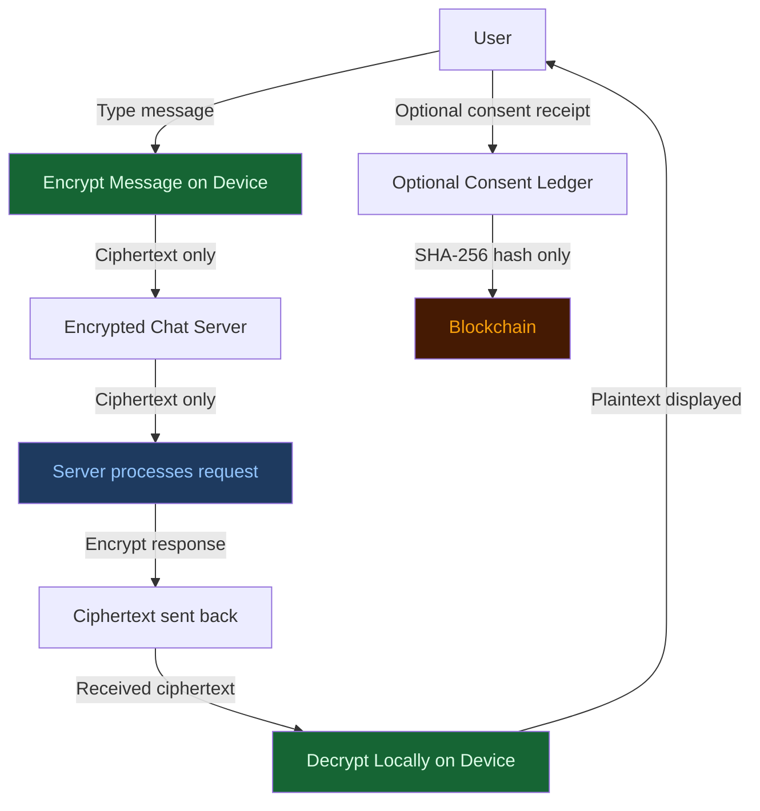

# End-to-End Encryption — SXWer AI ChatBot

## Overview

SXWer AI uses **end-to-end encryption (E2E)** for chat messages.  
Messages are encrypted on your device before they leave.  
The server stores and relays ciphertext only.  
The server cannot read your messages.

---

## Architecture Diagram

---

## How Encryption Works

### Algorithm

**X25519 key exchange + XSalsa20-Poly1305 authenticated encryption**  
(TweetNaCl `nacl.box`)

This is a modern, audited, widely-deployed cryptographic scheme that provides:

- **Confidentiality** — only the intended recipient can read the message
- **Authenticity** — the recipient can verify the message came from the sender
- **Integrity** — any tampering is detected and the message is rejected

### Step-by-Step Message Flow

1. **Key pair generation** — On first use, your device generates an X25519 key pair. The private key never leaves your device. The public key is registered with the server.

2. **Handshake** — Your device sends its public key to the server (`POST /api/crypto/handshake`). The server returns its own public key. Both sides independently compute the same shared secret using Diffie-Hellman. The shared secret is **never transmitted**.

3. **Encrypt locally** — Before your message is sent, it is encrypted with the shared secret and a unique random 24-byte nonce using `nacl.box`.

4. **Send ciphertext** — Only the ciphertext, nonce, and your public key are sent to the server. The server never receives your message in plaintext.

5. **Server relays** — The server routes the request, processes contextual metadata (consent state, offline mode), and encrypts the response with the shared secret.

6. **Decrypt locally** — Your device decrypts the server's response using the shared secret and nonce.

---

## What the Server Stores

| Data | Stored by server |
|------|-----------------|
| Encrypted message (ciphertext) | ✅ Temporarily, in memory, for processing |
| Plaintext message | ❌ Never |
| Your private key | ❌ Never |
| The shared secret | ❌ Never (computed locally on both sides) |
| Your public key | ✅ In session memory (cleared on rotation or session end) |
| Nonces | ✅ Tracked per session for replay prevention (2-hour TTL) |

---

## Blockchain

### What the Blockchain Stores

The blockchain is **optional** and **never stores chat messages**.

The blockchain stores only:

- Consent granted / revoked receipts (SHA-256 hash + timestamp)
- Policy version accepted
- Moderation decision hashes
- Document hashes
- Timestamps

All stored values are SHA-256 hashes. No plaintext is ever written to the blockchain.

### What the Blockchain Never Stores

- Messages
- Usernames
- Prompts
- AI responses
- Files, photos, video, voice
- IP addresses
- Personal data of any kind

### Why Blockchain Does Not Store Chat Messages

Chat messages are personal, sensitive, and often contain information that could harm users if disclosed. Blockchain ledgers are **permanent and public** — once data is written, it cannot be deleted.

Storing message hashes would allow correlation attacks: an adversary with access to the original message could verify whether it was sent, when, and by whom. This violates the privacy model of the application.

The blockchain exists only as a **verification ledger** for consent and policy decisions — not as a conversation store.

---

## Security Properties

| Property | Provided |
|----------|---------|
| Confidentiality (server cannot read messages) | ✅ |
| Authenticity (tampered messages are rejected) | ✅ |
| Replay protection (nonce tracking per session) | ✅ |
| Forward secrecy (key rotation supported) | ✅ (manual) |
| Key export / import (PBKDF2-AES-GCM) | ✅ |
| Offline-first (all crypto runs in browser) | ✅ |

---

## Privacy Model

- Your private key is held only in your browser's JavaScript memory.
- It is never written to `localStorage`, `IndexedDB`, cookies, or any persistent storage.
- It is lost when you close the tab (ephemeral, per-session model).
- Your public key is stored in `sessionStorage` for soft navigations within the same tab.
- When you export your keys, they are encrypted with PBKDF2 (310,000 iterations, SHA-256) → AES-GCM before download. The raw private key is never written to disk unencrypted.

---

## Threat Model

### Protected Against

- **Network eavesdropping** — all message contents are ciphertext on the wire
- **Server breach** — stored ciphertext is useless without the shared secret
- **Replay attacks** — server tracks nonces; replayed messages are rejected
- **Message tampering** — authenticated encryption detects any modification

### Not Protected Against

- **Compromised browser or device** — if your device is compromised, an attacker can read the decrypted messages on screen or extract keys from memory
- **Malicious server public key** (key-substitution attack) — if the server returns a different public key during handshake, an attacker could intercept messages. Mitigate by verifying the server's public key out-of-band via `/api/crypto/status`
- **Browser extension attacks** — a malicious extension with page access could intercept messages before encryption
- **Legal compulsion** — if you are in a jurisdiction where the server operator could be compelled to modify the server to log keys, E2E encryption does not protect you

---

## Trust Assumptions

1. The TweetNaCl library is audited and trustworthy (version 1.0.3).
2. The server is not actively replacing its public key during an ongoing session.
3. Your browser is not compromised.
4. The Web Crypto API (for key export/import) is implemented correctly by your browser.

---

## Key Management

### Key Rotation

Keys can be rotated from the **Encryption Status** page (`/encryption-status`).

When you rotate keys:
1. A new key pair is generated locally.
2. The old private key is zeroed in memory.
3. The server's registration of your old public key is cleared.
4. Any messages encrypted to your old key become permanently unreadable.

### Key Export

Keys can be exported as an encrypted JSON file from `/encryption-status`.

The export uses:
- PBKDF2 key derivation: 310,000 iterations, SHA-256, random 16-byte salt
- AES-GCM encryption: 256-bit key, random 12-byte IV

The exported file is safe to store in a password manager or on disk.

### Key Import

Keys can be imported from a previously exported file. Importing replaces the current key pair.

---

## User Rights

From `/encryption-status`, users can:

- View current encryption status
- View their public key
- Copy their public key to clipboard
- Export keys (encrypted backup)
- Import keys (restore backup)
- Rotate keys (generate new pair)
- Delete local key data
- View consent ledger
- Disable blockchain logging

Users can continue chatting without blockchain at any time.

---

## Server Endpoints

| Endpoint | Method | Description |
|----------|--------|-------------|
| `/api/session` | GET | Create session; returns session token + CSRF token |
| `/api/crypto/handshake` | POST | Exchange public keys |
| `/api/crypto/server-key` | GET | Retrieve current server public key |
| `/api/crypto/status` | GET | E2E encryption status and capabilities |
| `/api/crypto/disclosure` | GET | Plain-language disclosure of what encryption does |
| `/api/chat/encrypted` | POST | Send encrypted message; receive encrypted response |
| `/api/crypto/rotate-client-key` | POST | Notify server to clear old client key registration |

---

## Libraries Used

| Library | Version | Purpose |
|---------|---------|---------|
| [TweetNaCl](https://github.com/dchest/tweetnacl-js) | 1.0.3 | X25519 + XSalsa20-Poly1305 encryption |
| [TweetNaCl-util](https://github.com/dchest/tweetnacl-util-js) | 0.15.1 | UTF-8 encoding utilities |
| Web Crypto API | Browser built-in | PBKDF2 key derivation, AES-GCM key export |

Both TweetNaCl libraries are bundled locally (`public/nacl.min.js`, `public/nacl-util.min.js`) and do not require a CDN connection. This supports the offline-first architecture.
