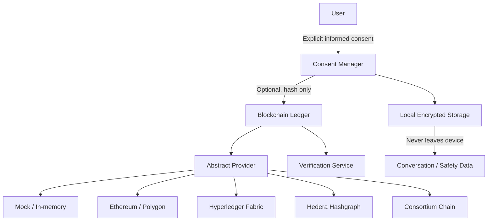

# SXWer AI ChatBot

A trauma-informed, privacy-first chat experience built for calm, local use. The app is designed to center dignity, autonomy, and safety while keeping the experience simple and easy to understand.

## What the current project includes

- A local web server in [server-offline.js](server-offline.js)
- Ethical response formatting and consent checks in [chatbot.js](chatbot.js)
- A simple chat UI with a help popup, dark/light mode, and clear input flow in [index.html](index.html)
- A Moxie desktop companion with check-ins and a floating widget in [index.html](index.html) and [public/moxie.css](public/moxie.css)
- Optional online AI support through a Mistral-compatible API when environment variables are configured
- Optional Python microservice in [python/](python/) for enhanced NLP, local LLM inference, and voice processing

## Core principles

- Dignity first: the user stays in control.
- No assumptions: the experience avoids diagnosis and overreach.
- Transparency: capabilities and limits are explained clearly.
- Autonomy: consent is required for AI and tool use.
- Safety: crisis and sensitive topics are handled with care.

## Quick start

Requirements:

- Node.js 18 or newer

Install dependencies:

```bash
npm install
```

Start the app:

```bash
npm start
```

Then open http://localhost:3000.

## Basic usage

You can use the app in a few simple ways:

- Type a normal message in the chat box and press Send.
- Use /help to see the available commands.
- Use /consent yes to allow AI assistance.
- Use /consent no to keep the experience local-only.
- AI consent and offline local-permission choices are kept only for the current browser session.
- Use /sherlock username for your own safety verification only, after consent.
- Use /moxie message to talk with Moxie, your desktop companion.
- Use /resources to view support resources.

## Optional online AI

The app works well offline by default. If you want to use an online model, copy [.env.example](.env.example) to .env and update the values. The Node server now loads `.env` automatically at startup:

```bash
cp .env.example .env
```

Then set:

- ONLINE_API_ENABLED=true
- MISTRAL_API_KEY=your_key_here
- MISTRAL_API_BASE=https://api.mistral.ai/v1/chat/completions

If these values are not set, the app stays in its safe offline mode.

## Optional Python microservice

The [python/](python/) directory adds enhanced capabilities through a FastAPI service that runs alongside the Node server. Everything runs locally — no data leaves your device. The Python service now auto-loads a local `.env` file on startup as well.

| Feature | Description |
|---------|-------------|
| NLP & Sentiment | Intent classification and emotional tone detection (transformers/keyword fallback) |
| Safety Classifier | scikit-learn ML model for richer crisis and risk detection |
| Local LLM | On-device language model via Ollama (Mistral, Phi-3, Llama 3) |
| Voice STT | Offline speech-to-text via Vosk |
| Voice TTS | Offline text-to-speech via pyttsx3 or Mimic 3 |
| Resource Manager | URL validation and deduplication for resources.json |

### Quick start (Python service)

Requirements: Python 3.10 or newer

```bash
cd python
pip install -r requirements.txt
uvicorn app:app --host 127.0.0.1 --port 8000
```

Then add to your `.env`:

```
PYTHON_API_URL=http://localhost:8000
```

The Node server falls back gracefully if the Python service is not running. In the Node-only path, local model files are treated as assets/metadata; real on-device inference happens through the Python + Ollama path.
See [python/README.md](python/README.md) for full setup instructions, including Ollama and voice pipeline setup.

## Privacy and safety

- The default experience is local-first and does not require external services.
- The Python microservice processes everything on-device and stores nothing.
- AI-assisted replies include a short explanation of the provider, data use, and safety checks.
- AI replies are screened for high-confidence bias markers before they are shown.
- Do not commit real API keys or secrets.
- Keep sensitive values in a local .env file.
- The app is not a substitute for professional medical, legal, or crisis services.

## Optional blockchain consent ledger

This app includes an **optional, opt-in** cryptographic consent ledger.

### Why it exists

Some users want a tamper-evident audit trail proving that consent was given, revised, or revoked — and when. Blockchain provides immutable, verifiable receipts without requiring trust in any single server.

### What is stored on-chain

Only anonymous, non-reversible consent receipts:

| Field | Description |
|---|---|
| `eventType` | e.g. `CONSENT_GRANTED`, `CONSENT_REVOKED` |
| `documentHash` | SHA-256 hash of the consent document — never the document itself |
| `receiptHash` | SHA-256 of the full receipt object |
| `timestamp` | Unix milliseconds |
| `policyVersion` | Which version of the policy was accepted |
| `schemaVersion` | Receipt schema version |
| `appVersion` | Application version |
| `nonce` | Replay-protection value |
| `walletId` | Optional pseudonymous identifier |
| `signature` | Optional digital signature |

### What is **never** stored

Conversation history · prompts · AI responses · user names · emails · phone numbers · GPS · messages · attachments · photos · videos · safety plans · health information · legal records · any PII

### Human Rights by Design

Every blockchain feature must answer YES to all eight questions:

1. **Can the user understand what is happening?** Yes — every event is shown in plain language.
2. **Can the user meaningfully consent?** Yes — the full disclosure is shown before activation.
3. **Can the user refuse?** Yes — blockchain is always optional; the app works without it.
4. **Can they revoke consent?** Yes — the "Revoke Consent" button writes an immutable revocation receipt.
5. **Can they inspect their data?** Yes — the Consent Ledger page shows every record.
6. **Can they export it?** Yes — "Export Consent" downloads a portable JSON file.
7. **Can they delete local data?** Yes — "Disable Blockchain" clears the local ledger.
8. **Can they continue without blockchain?** Yes — local-first is always the default.

### Privacy architecture

```
Client
  ↓
Consent Manager (consent_manager.js)
  ↓
Local Encrypted Storage (IndexedDB / in-memory)
  ↓ (optional — only when BLOCKCHAIN_ENABLED=true and user has consented)
Optional Blockchain Ledger (services/blockchain/consentLedger.js)
  ↓
Verification Service (services/blockchain/hashService.js)
```



### Threat model

| Threat | Mitigation |
|---|---|
| PII leakage to blockchain | Only SHA-256 hashes of documents are written; raw content never leaves the device |
| Private key exposure | Keys held only in memory during signing; immediately cleared on disconnect |
| Provider unavailability | Graceful degradation — app continues offline; receipts retained locally |
| Silent blockchain activation | `BLOCKCHAIN_ENABLED` defaults to `false`; requires explicit user opt-in |
| Secrets committed to repo | All keys read from environment variables; `.env` is in `.gitignore` |
| Receipt tampering | Each receipt includes a hash of its own content; `verifyConsent()` detects modification |

### Consent lifecycle

```
User opens app (blockchain disabled by default)
  → User navigates to Consent Ledger page
  → Full disclosure is displayed
  → User clicks "I understand — Enable Blockchain"
  → CONSENT_GRANTED receipt created and submitted
  → User uses the app normally
  → User can revoke at any time → CONSENT_REVOKED receipt written
  → User can export ledger history at any time
  → User can disable blockchain → local ledger cleared, wallet disconnected
```

### Data lifecycle

| Data | Storage | Deletable |
|---|---|---|
| Consent receipts (local) | In-memory (session) | Yes — "Disable Blockchain" |
| On-chain consent receipts | Blockchain (if enabled) | Immutable by design (contains no PII) |
| Conversation history | Local only | Yes — via "Delete my data" |
| Safety plans | Local only | Yes |
| Settings | Local only | Yes |

### Enabling blockchain (optional)

1. Read and accept the disclosure on the Consent Ledger page, or set in `.env`:

```
BLOCKCHAIN_ENABLED=true
BLOCKCHAIN_PROVIDER=mock   # or ethereum, polygon, hyperledger, hedera, consortium
```

2. Configure your chosen provider in `.env` (see `.env.example`).
3. Restart the server.

The app works identically without blockchain. Blockchain adds only an optional audit trail.

## Copying or sharing the project

To share or copy this chatbot:

1. Copy the whole project folder to another computer.
2. Run npm install.
3. Run npm start.
4. Open the local URL in a browser.

This makes it easy to run as a portable, offline-friendly project. If you want the online AI option, configure .env before starting.

## Main files

- [index.html](index.html) — chat UI, help popup, dark/light mode, Moxie widget
- [server-offline.js](server-offline.js) — server routes, offline/online behavior, API endpoints
- [chatbot.js](chatbot.js) — ethical response logic, consent handling, safety checks
- [consent_manager.js](consent_manager.js) — session consent and data minimization
- [services/blockchain/](services/blockchain/) — optional consent ledger (blockchain abstraction)
  - `ledgerConfig.js` — configuration and event type vocabulary
  - `hashService.js` — SHA-256 consent document hashing
  - `walletService.js` — abstract wallet management
  - `blockchainService.js` — abstract provider interface
  - `consentLedger.js` — consent recording API
- [public/consent-ledger.html](public/consent-ledger.html) — Consent Ledger UI (WCAG 2.2 AA)
- [.env.example](.env.example) — safe example environment configuration
- [python/](python/) — optional Python microservice (NLP, local LLM, voice, resource tools)
