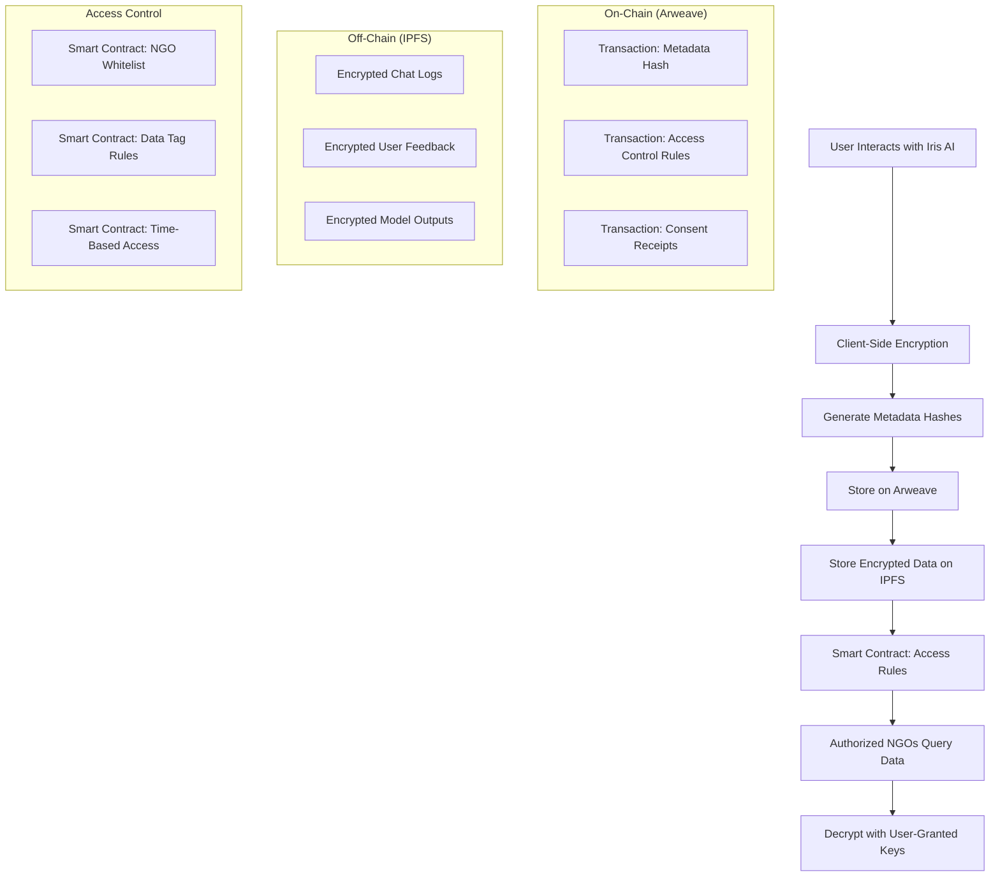
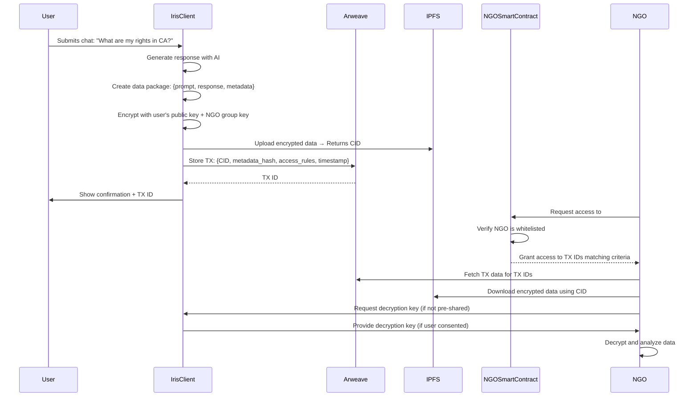

# NGO Collaboration Blockchain Integration - Technical Specification

## Overview

This document specifies the **NGO Collaboration Use Case** for Iris's blockchain integration, enabling **secure, auditable, and consent-based data sharing** between sex worker advocacy organizations (e.g., AAIR, SWOP, local NGOs) while preserving **user autonomy, privacy, and censorship resistance**.

---

## 1. Use Case: NGO Collaboration for AI Interaction Data

### 1.1 Problem Statement
Sex worker advocacy organizations need to:
- **Share anonymized AI interaction data** to improve resources and training
- **Audit AI advice** for accuracy, bias, and safety
- **Prove data integrity** (e.g., "This advice was generated on [date] with model [version]")
- **Collaborate across jurisdictions** without central points of failure
- **Respect user consent** and privacy (GDPR, "right to be forgotten")

### 1.2 Solution: Decentralized Data Sharing with Arweave + IPFS

| **Component**       | **Purpose**                                                                 | **Example**                                                                 |
|----------------------|-----------------------------------------------------------------------------|-----------------------------------------------------------------------------|
| **Arweave**          | Permanent, low-cost storage of **metadata hashes** and access control rules | Store `sha256(prompt_hash + response_hash + timestamp + model_version)`     |
| **IPFS**             | Decentralized storage of **encrypted full data** (prompts, responses)      | Store encrypted JSON: `{prompt: "...", response: "...", metadata: {...}}`   |
| **Encryption**       | Client-side encryption with **user-controlled keys**                     | Libsodium (X25519 + XSalsa20-Poly1305) or TweetNaCl                        |
| **Smart Contracts**  | Access control rules (who can decrypt what)                              | "Only AAIR and SWOP can access chats tagged with #legal-advice"          |

---

## 2. Architecture

### 2.1 High-Level Architecture Diagram



### 2.2 Data Flow Diagram



---

## 3. Data Model

### 3.1 On-Chain Data (Arweave)

**Transaction Structure** (stored permanently on Arweave):
```json
{
  "schemaVersion": "2.0.0",
  "eventType": "AI_INTERACTION",
  "transactionType": "NGO_COLLABORATION",
  "data": {
    "ipfsCid": "QmXoypizjW3WknFiJnKLwHCnL72vedxjQkDDP1mXWo6uco",
    "metadataHash": "sha256:9f86d081884c7d659a2feaa0c55ad015a3bf4f1b2b0b822cd15d6c15b0f00a08",
    "accessControl": {
      "allowedNGOs": ["aair", "swop", "local_ngo_123"],
      "requiredTags": ["legal", "california"],
      "expiry": "2025-12-31T00:00:00Z",
      "encryptionScheme": "x25519-xsalsa20-poly1305"
    },
    "consent": {
      "userConsentGiven": true,
      "userConsentTimestamp": 1716200000000,
      "ngoConsentGiven": true,
      "consentVersion": "1.0.0"
    },
    "metadata": {
      "timestamp": 1716200000000,
      "modelVersion": "iris-v2.1",
      "sessionId": "anon_7x9k2",
      "tags": ["legal", "california", "rights"],
      "language": "en",
      "interactionId": "uuid_v4"
    }
  },
  "signatures": {
    "userSignature": "3045022100...",
    "ngoSignature": "30450220...",
    "irisSignature": "30440221..."
  }
}
```

**Fields Explained**:
| Field               | Type     | Description                                                                 | Example                                                                 |
|---------------------|----------|-----------------------------------------------------------------------------|-------------------------------------------------------------------------|
| `ipfsCid`           | string   | IPFS Content Identifier for encrypted data                                | `QmXoypizjW3WknFiJnKLwHCnL72vedxjQkDDP1mXWo6uco`                     |
| `metadataHash`      | string   | SHA-256 hash of the metadata + data hashes (for integrity verification)   | `sha256:9f86d0...`                                                     |
| `allowedNGOs`       | array    | List of NGO IDs authorized to access this data                            | `["aair", "swop"]`                                                   |
| `requiredTags`      | array    | Tags required for an NGO to access this data                             | `["legal", "california"]`                                             |
| `expiry`            | string   | Optional expiry date for access                                            | `2025-12-31T00:00:00Z`                                                |
| `encryptionScheme`  | string   | Encryption algorithm used                                                 | `x25519-xsalsa20-poly1305`                                             |
| `userConsentGiven`  | boolean  | Whether the user explicitly consented to NGO sharing                      | `true`                                                                 |
| `modelVersion`      | string   | Version of the AI model used                                              | `iris-v2.1`                                                          |
| `tags`              | array    | Categorization tags for filtering                                         | `["legal", "california", "rights"]`                                  |

### 3.2 Off-Chain Data (IPFS)

**Encrypted Data Package** (stored on IPFS):
```json
{
  "schemaVersion": "1.0.0",
  "interaction": {
    "prompt": "What are my rights as a sex worker in California?",
    "response": "In California, sex work is legal under certain conditions...",
    "model": "iris-v2.1",
    "timestamp": 1716200000000,
    "sessionId": "anon_7x9k2",
    "metadata": {
      "language": "en",
      "confidence": 0.95,
      "safetyFlags": [],
      "sources": ["CA Penal Code § 647(b)", "https://swopbehindbars.org/ca-laws"]
    }
  },
  "userFeedback": {
    "rating": 5,
    "comment": "This was very helpful!",
    "timestamp": 1716200005000
  },
  "accessLog": [
    {
      "ngoId": "aair",
      "accessedAt": 1716200100000,
      "purpose": "audit_legal_advice_quality"
    }
  ]
}
```

**Encryption**:
- **Algorithm**: X25519 key exchange + XSalsa20-Poly1305 (via TweetNaCl/Libsodium)
- **Key Management**:
  - **User Key**: Each user has a key pair (stored in browser's IndexedDB or wallet)
  - **NGO Group Key**: Shared symmetric key for authorized NGOs (distributed via smart contract)
  - **Hybrid Encryption**: Data encrypted with a **data-specific symmetric key**, which is then encrypted with the user's public key and the NGO group key

---

## 4. Smart Contract Design

### 4.1 Access Control Smart Contract (Solidity)

```solidity
// SPDX-License-Identifier: MIT
pragma solidity ^0.8.0;

contract NGOAccessControl {
    // Struct for access rules
    struct AccessRule {
        address[] allowedNGOs;
        string[] requiredTags;
        uint256 expiry;
        bool isActive;
    }
    
    // Struct for data records
    struct DataRecord {
        string ipfsCid;
        string metadataHash;
        bytes32 encryptedSymmetricKey; // Encrypted with NGO group key
        uint256 timestamp;
        address owner; // User's wallet address (or pseudonymous ID)
    }
    
    // Mapping of transaction IDs to data records
    mapping(bytes32 => DataRecord) public dataRecords;
    
    // Mapping of NGO addresses to their metadata
    mapping(address => NGO) public ngos;
    
    // Mapping of tags to transaction IDs
    mapping(string => bytes32[]) public tagIndex;
    
    // Whitelist of authorized NGOs
    address[] public authorizedNGOs;
    mapping(address => bool) public isAuthorizedNGO;
    
    // Events
    event DataStored(bytes32 indexed txId, string ipfsCid, address indexed owner);
    event NGOWhitelisted(address indexed ngo, string name);
    event AccessGranted(address indexed ngo, bytes32 indexed txId);
    
    struct NGO {
        string name;
        string description;
        bool isActive;
        uint256 joinedAt;
    }
    
    // Modifier to check if caller is an authorized NGO
    modifier onlyAuthorizedNGO() {
        require(isAuthorizedNGO[msg.sender], "NGO not authorized");
        _;
    }
    
    // Add an NGO to the whitelist (callable by contract owner)
    function addNGO(address _ngo, string memory _name, string memory _description) public {
        require(msg.sender == owner(), "Only owner can add NGOs");
        isAuthorizedNGO[_ngo] = true;
        authorizedNGOs.push(_ngo);
        ngos[_ngo] = NGO({
            name: _name,
            description: _description,
            isActive: true,
            joinedAt: block.timestamp
        });
        emit NGOWhitelisted(_ngo, _name);
    }
    
    // Store a new data record
    function storeData(
        bytes32 txId,
        string memory ipfsCid,
        string memory metadataHash,
        bytes32 encryptedSymmetricKey,
        string[] memory tags
    ) public {
        dataRecords[txId] = DataRecord({
            ipfsCid: ipfsCid,
            metadataHash: metadataHash,
            encryptedSymmetricKey: encryptedSymmetricKey,
            timestamp: block.timestamp,
            owner: msg.sender
        });
        
        for (uint i = 0; i < tags.length; i++) {
            tagIndex[tags[i]].push(txId);
        }
        
        emit DataStored(txId, ipfsCid, msg.sender);
    }
    
    // Grant access to a specific transaction
    function grantAccess(bytes32 txId) public onlyAuthorizedNGO {
        require(dataRecords[txId].owner != address(0), "Data record does not exist");
        emit AccessGranted(msg.sender, txId);
    }
    
    // Query data records by tags
    function queryByTags(string[] memory tags) public view returns (bytes32[] memory) {
        bytes32[] memory results;
        for (uint i = 0; i < tags.length; i++) {
            bytes32[] storage txIds = tagIndex[tags[i]];
            for (uint j = 0; j < txIds.length; j++) {
                results.push(txIds[j]);
            }
        }
        return results;
    }
    
    // Get data record details
    function getDataRecord(bytes32 txId) public view returns (DataRecord memory) {
        return dataRecords[txId];
    }
}
```

### 4.2 Contract Deployment

| **Network**       | **Purpose**                          | **Contract Address** | **Notes**                                  |
|-------------------|--------------------------------------|----------------------|--------------------------------------------|
| Polygon Mainnet   | Production NGO collaboration         | TBD                  | Low fees, Ethereum-compatible              |
| Arweave           | Permanent data storage               | N/A                  | Used for TX storage, not smart contracts   |
| Local (Hardhat)   | Development/testing                  | Local                | For PoC and integration testing             |

---

## 5. Implementation Components

### 5.1 New Files to Create

```
services/blockchain/
├── arweaveService.js       # Arweave transaction submission and querying
├── ipfsService.js          # IPFS upload/download with encryption
├── ngoAccessControl.js     # NGO-specific access control logic
├── dataEncryption.js       # Client-side encryption/decryption utilities
└── ngoCollaboration.js     # Main integration module

public/
├── ngo-dashboard.html      # NGO collaboration dashboard UI
└── ngo-api.js              # Client-side NGO API utilities

routes/
└── ngoRoutes.js            # Server routes for NGO collaboration

tests/
└── ngoCollaboration.test.js # Tests for NGO collaboration features
```

### 5.2 Integration with Existing System

**Existing Components to Extend**:
1. `services/blockchain/blockchainService.js` - Add Arweave provider
2. `services/blockchain/ledgerConfig.js` - Add Arweave configuration
3. `services/crypto/messageEncryption.js` - Extend for hybrid encryption
4. `consent_manager.js` - Add NGO consent scopes

---

## 6. Security Considerations

### 6.1 Threat Model and Mitigations

| **Threat**                          | **Likelihood** | **Impact** | **Mitigation**                                                                 |
|-------------------------------------|----------------|------------|---------------------------------------------------------------------------------|
| PII leakage to blockchain            | Low            | High       | Only hashes stored on-chain; full data encrypted on IPFS                       |
| Unauthorized NGO access              | Medium         | High       | Smart contract whitelist + user consent required for each data share          |
| Data tampering                      | Low            | High       | Cryptographic hashes + signatures; IPFS content addressing                       |
| Encryption key compromise            | Low            | High       | Ephemeral keys; hybrid encryption (data key + user key + NGO key)              |
| IPFS content removal                | Medium         | Medium     | Replicate to multiple IPFS nodes; use Filecoin for permanent storage           |
| GDPR "right to be forgotten"         | High           | High       | Store only encrypted data; "delete" = revoke decryption keys                   |
| Censorship by central authority      | Medium         | High       | Decentralized storage (Arweave + IPFS); no single point of failure              |
| Replay attacks                       | Low            | Medium     | Nonces in all transactions; timestamp validation                                |

### 6.2 Privacy by Design

1. **Data Minimization**: Only store what's necessary for the use case
   - On-chain: Hashes + metadata + access rules
   - Off-chain: Encrypted full data

2. **Purpose Limitation**: Data is only used for NGO collaboration and audit

3. **Storage Limitation**: 
   - On-chain data: Permanent (Arweave)
   - Off-chain data: Permanent (IPFS + Filecoin) or ephemeral (user's choice)

4. **User Control**:
   - Users must explicitly consent to NGO sharing
   - Users can revoke consent at any time
   - Users can inspect all shared data
   - Users can request deletion (via key revocation)

5. **Transparency**:
   - All NGO access is logged on-chain
   - Users can audit who accessed their data

---

## 7. Consent Flow for NGO Collaboration

### 7.1 User Consent for NGO Sharing

```mermaid
flowchart TD
    A[User starts chat with Iris] --> B[Iris generates response]
    B --> C[Iris asks: "Allow NGOs to access this chat for improving resources?"]
    C --> D{User chooses}
    D -->|Yes| E[Show NGO list and purposes]
    E --> F[User selects specific NGOs]
    F --> G[User confirms consent]
    G --> H[Store consent receipt on blockchain]
    H --> I[Encrypt and store chat on IPFS]
    I --> J[Store metadata hash on Arweave]
    D -->|No| K[Store locally only]
```

### 7.2 Consent Receipt for NGO Sharing

```json
{
  "schemaVersion": "1.0.0",
  "eventType": "NGO_DATA_SHARING_CONSENT",
  "consent": {
    "userId": "anon_7x9k2",
    "timestamp": 1716200000000,
    "ngos": ["aair", "swop"],
    "purpose": "improve_ai_responses_and_resources",
    "dataTypes": ["chat_logs", "feedback"],
    "expiry": "2025-12-31T00:00:00Z",
    "revocable": true
  },
  "data": {
    "interactionId": "uuid_v4",
    "ipfsCid": "QmXoypizjW3WknFiJnKLwHCnL72vedxjQkDDP1mXWo6uco",
    "arweaveTxId": "abc123..."
  },
  "signatures": {
    "userSignature": "3045022100...",
    "irisSignature": "30440221..."
  }
}
```

---

## 8. API Endpoints

### 8.1 Server-Side Endpoints

| **Endpoint**                     | **Method** | **Description**                                                                 | **Authentication** | **Rate Limit** |
|----------------------------------|------------|---------------------------------------------------------------------------------|--------------------|----------------|
| `/api/ngo/data`                  | POST       | Store AI interaction data for NGO collaboration                              | User session       | 10/min         |
| `/api/ngo/data/:txId`            | GET        | Retrieve metadata for a specific transaction                                  | NGO JWT            | 100/min        |
| `/api/ngo/data`                  | GET        | Query data by tags, NGOs, date range                                           | NGO JWT            | 50/min         |
| `/api/ngo/consent`               | POST       | Record user consent for NGO sharing                                            | User session       | 10/min         |
| `/api/ngo/consent/revoke`         | POST       | Revoke user consent for NGO sharing                                            | User session       | 10/min         |
| `/api/ngo/access-log`            | GET        | Get access log for user's data                                                 | User session       | 20/min         |
| `/api/ngo/keys`                  | POST       | Request decryption key for authorized access                                  | NGO JWT            | 5/min          |

### 8.2 Client-Side Functions

```javascript
// Store AI interaction for NGO collaboration
async function storeForNGO(interactionData, options = {}) {
  const { ngos = [], tags = [], expiry, purpose } = options;
  
  // 1. Get user consent
  const consent = await requestUserConsent(ngos, purpose);
  if (!consent.granted) return null;
  
  // 2. Encrypt the data
  const { encryptedData, symmetricKey, ipfsCid } = await encryptAndStoreOnIPFS(interactionData);
  
  // 3. Encrypt symmetric key for NGOs
  const encryptedSymmetricKeys = await encryptSymmetricKeyForNGOs(symmetricKey, ngos);
  
  // 4. Create metadata hash
  const metadataHash = createMetadataHash(interactionData, ngos, tags);
  
  // 5. Store on Arweave
  const arweaveTx = await storeOnArweave({
    ipfsCid,
    metadataHash,
    encryptedSymmetricKeys,
    accessControl: { ngos, tags, expiry },
    consent
  });
  
  // 6. Store consent receipt on existing ledger
  await recordNGOConsent(consent, arweaveTx.txId);
  
  return { arweaveTx, ipfsCid, consent };
}

// Query data as an NGO
async function queryNGOData(query = {}) {
  const { tags = [], ngos = [], dateRange, limit = 100 } = query;
  
  // 1. Query Arweave for matching transactions
  const txIds = await queryArweaveByTags(tags, ngos, dateRange, limit);
  
  // 2. For each TX, check access control
  const accessibleTxIds = await filterByAccessControl(txIds);
  
  // 3. Fetch metadata from Arweave
  const metadataList = await fetchMetadataBatch(accessibleTxIds);
  
  // 4. Request decryption keys
  const decryptedData = await requestAndDecryptBatch(metadataList);
  
  return decryptedData;
}
```

---

## 9. Error Handling

### 9.1 Error Codes

| **Code**            | **Description**                                                                 | **HTTP Status** | **User Action**                          |
|---------------------|---------------------------------------------------------------------------------|-----------------|------------------------------------------|
| `NGO_NOT_AUTHORIZED`| NGO is not whitelisted for access                                             | 403             | Contact admin to request access          |
| `CONSENT_REQUIRED`  | User has not consented to NGO sharing                                          | 403             | Request user consent                     |
| `CONSENT_REVOKED`   | User has revoked consent for this data                                         | 403             | Respect revocation                       |
| `DATA_EXPIRED`      | Access expiry date has passed                                                   | 410             | Request new consent from user             |
| `DECRYPTION_FAILED` | Failed to decrypt data (wrong key or corrupted)                                | 400             | Verify encryption keys                    |
| `IPFS_UNAVAILABLE`  | IPFS node is down or CID not found                                             | 503             | Retry or use fallback node               |
| `ARWEAVE_UNAVAILABLE`| Arweave node is down                                                          | 503             | Retry or use fallback node               |
| `INVALID_SIGNATURE` | Transaction signature verification failed                                      | 400             | Verify transaction integrity              |

### 9.2 Retry Logic

```javascript
const RETRY_CONFIG = {
  ipfs: {
    maxRetries: 3,
    retryDelay: 1000, // 1 second
    backoffMultiplier: 2
  },
  arweave: {
    maxRetries: 5,
    retryDelay: 2000, // 2 seconds
    backoffMultiplier: 1.5
  },
  decryption: {
    maxRetries: 1, // No retries for decryption (likely permanent failure)
    retryDelay: 0
  }
};
```

---

## 10. Monitoring and Analytics

### 10.1 Metrics to Track

| **Metric**                          | **Description**                                                                 | **Frequency** | **Storage**          |
|-------------------------------------|---------------------------------------------------------------------------------|---------------|----------------------|
| `ngo_data_stored`                   | Number of AI interactions stored for NGO collaboration                        | Per TX        | On-chain (Arweave)   |
| `ngo_data_accessed`                 | Number of times NGOs access data                                                | Per access    | On-chain (Arweave)   |
| `ngo_consent_granted`               | Number of users who consent to NGO sharing                                       | Per consent   | On-chain (Arweave)   |
| `ngo_consent_revoked`               | Number of users who revoke NGO sharing consent                                   | Per revocation | On-chain (Arweave)   |
| `ngo_query_latency`                 | Time taken to query and retrieve data                                           | Per query     | Local logs           |
| `ngo_decryption_failures`           | Number of failed decryption attempts                                            | Per failure   | Local logs           |

### 10.2 Alerts

| **Alert**                          | **Condition**                                                                   | **Severity** | **Notification**       |
|------------------------------------|-------------------------------------------------------------------------------|--------------|------------------------|
| High query latency                 | Average query latency > 5 seconds                                              | Warning      | Log + Admin email      |
| Decryption failure rate > 5%       | More than 5% of decryption attempts fail                                       | Critical     | Log + Admin email + SMS|
| NGO access denied rate > 10%       | More than 10% of NGO access requests are denied                                | Warning      | Log + Admin email      |
| Arweave node down                  | Cannot connect to Arweave for > 1 minute                                        | Critical     | Log + Admin alert      |
| IPFS node down                     | Cannot connect to IPFS for > 1 minute                                           | Critical     | Log + Admin alert      |

---

## 11. Deployment Plan

### 11.1 Phase 1: PoC (1-2 weeks)
- [ ] Implement Arweave service for transaction storage
- [ ] Implement IPFS service with encryption
- [ ] Create basic NGO access control
- [ ] Build PoC UI for user consent and NGO querying
- [ ] Write tests for core functionality

### 11.2 Phase 2: Integration (2-3 weeks)
- [ ] Integrate with existing consent ledger
- [ ] Add NGO dashboard UI
- [ ] Implement smart contract (Polygon testnet)
- [ ] Add rate limiting and error handling
- [ ] Write integration tests

### 11.3 Phase 3: Production (2-4 weeks)
- [ ] Deploy smart contract to Polygon mainnet
- [ ] Set up monitoring and alerts
- [ ] Create documentation for NGOs
- [ ] Conduct security audit
- [ ] Gradual rollout to users

---

## 12. Cost Analysis

### 12.1 Arweave Costs

| **Data Size** | **Cost per TX** | **Notes**                                  |
|---------------|-----------------|--------------------------------------------|
| 1 KB          | ~$0.0001        | Metadata hash + access control rules       |
| 10 KB         | ~$0.001         | Larger metadata                            |
| 100 KB        | ~$0.01          | Very large metadata (unlikely)            |

**Estimated Monthly Cost for 10,000 Interactions**:
- Average TX size: 2 KB
- Total cost: 10,000 * $0.0002 = **$2/month**

### 12.2 IPFS Costs

| **Service**       | **Cost**               | **Notes**                                  |
|-------------------|------------------------|--------------------------------------------|
| Infura IPFS       | Free tier available    | 10 GB storage, 100 GB bandwidth/month       |
| Filecoin          | ~$0.000002/GB/month    | Permanent storage                          |
| Local IPFS node   | Free                   | Self-hosted                                |

**Estimated Monthly Cost for 10,000 Interactions**:
- Average encrypted data size: 5 KB
- Total storage: 10,000 * 5 KB = 50 MB
- Total cost: **~$0.0001/month** (Filecoin) or **$0** (Infura free tier)

### 12.3 Polygon Costs (Smart Contracts)

| **Operation**         | **Gas Cost** | **MATIC Cost** | **USD Cost** |
|-----------------------|--------------|----------------|--------------|
| Store data record     | ~50,000 gas  | ~0.0001 MATIC  | ~$0.00001    |
| Query data            | ~20,000 gas  | ~0.00004 MATIC | ~$0.000004   |
| Add NGO to whitelist  | ~30,000 gas  | ~0.00006 MATIC | ~$0.000006   |

**Estimated Monthly Cost for 10,000 Interactions**:
- Total cost: **~$0.10/month**

### 12.4 Total Estimated Monthly Cost

| **Component**   | **Cost**       |
|----------------|---------------|
| Arweave        | ~$2           |
| IPFS           | ~$0           |
| Polygon        | ~$0.10        |
| **Total**      | **~$2.10**    |

---

## 13. Compliance

### 13.1 GDPR Compliance

| **Requirement**               | **Implementation**                                                                 |
|-------------------------------|------------------------------------------------------------------------------------|
| Lawful basis for processing   | Explicit user consent (Article 6(1)(a))                                          |
| Special category data          | Not processed (no health, biometric, or other special category data)              |
| Data minimization             | Only necessary data stored; PII never on-chain                                    |
| Purpose limitation             | Data only used for NGO collaboration and audit                                   |
| Storage limitation             | Data stored only as long as necessary; users can revoke consent                   |
| Right to access               | Users can export all their data via dashboard                                     |
| Right to rectification        | Not applicable (data is encrypted; users can update via new transactions)         |
| Right to erasure              | Implemented via key revocation ("right to be forgotten")                        |
| Right to restrict processing  | Users can revoke consent to pause processing                                       |
| Right to data portability     | Users can export all their data in JSON format                                    |
| Right to object               | Users can object to processing (via consent revocation)                          |
| Automated decision-making     | Not applicable (no automated decisions based on this data)                       |

### 13.2 Other Compliance Frameworks

| **Framework**       | **Status** | **Notes**                                  |
|---------------------|------------|--------------------------------------------|
| CCPA                | Compliant  | Similar to GDPR; users can opt-out          |
| HIPAA               | N/A        | No health data processed                   |
| SOC 2 Type II       | Planned    | For production deployment                 |
| ISO 27001           | Planned    | For production deployment                 |

---

## 14. Future Enhancements

### 14.1 Short-Term (0-3 months)
- [ ] Add support for **Arweave SmartWeave** contracts for more complex access control
- [ ] Implement **proxy re-encryption** for GDPR-compliant "right to be forgotten"
- [ ] Add **zero-knowledge proofs** for selective data disclosure
- [ ] Support **multiple encryption schemes** (e.g., AES-256-GCM, ChaCha20-Poly1305)

### 14.2 Medium-Term (3-6 months)
- [ ] Add **reputation system** for NGOs (track data access patterns)
- [ ] Implement **automated anomaly detection** for suspicious access
- [ ] Add **geographic restrictions** (e.g., "Only NGOs in California can access CA-specific data")
- [ ] Support **time-based access** (e.g., "NGOs can access data for 30 days after creation")

### 14.3 Long-Term (6-12 months)
- [ ] Add **cross-chain interoperability** (e.g., store on Arweave, access control on Ethereum)
- [ ] Implement **decentralized identity (DID)** for users and NGOs
- [ ] Add **token-based incentives** for NGOs to contribute high-quality data
- [ ] Support **federated learning** (NGOs collaboratively improve AI models without sharing raw data)

---

## 15. Glossary

| **Term**               | **Definition**                                                                 |
|------------------------|-------------------------------------------------------------------------------|
| Arweave                | A blockchain protocol for permanent, low-cost data storage                   |
| IPFS                   | InterPlanetary File System; decentralized storage and content addressing    |
| CID                    | Content Identifier; a hash-based address for content in IPFS                 |
| Smart Contract         | Self-executing code on a blockchain that enforces rules                      |
| NGO                    | Non-Governmental Organization (e.g., AAIR, SWOP)                              |
| PII                    | Personally Identifiable Information                                           |
| GDPR                   | General Data Protection Regulation (EU privacy law)                          |
| ZKP                    | Zero-Knowledge Proof; a way to prove something without revealing the data   |
| DID                    | Decentralized Identifier; a self-sovereign identity standard                 |
| AEAD                   | Authenticated Encryption with Associated Data                                |

---

## 16. References

1. [Arweave Documentation](https://docs.arweave.org/)
2. [IPFS Documentation](https://docs.ipfs.tech/)
3. [Polygon Documentation](https://docs.polygon.technology/)
4. [TweetNaCl.js Documentation](https://tweetnacl.js.org/)
5. [Libsodium Documentation](https://doc.libsodium.org/)
6. [GDPR Full Text](https://gdpr-info.eu/)
7. [Solidity Documentation](https://docs.soliditylang.org/)
8. [Hardhat Documentation](https://hardhat.org/docs)

---

## Appendix A: Example Data Flows

### A.1 User Shares Chat with NGOs

```
1. User: "What are my rights as a sex worker in California?"
2. Iris: Generates response using AI model
3. Iris: "Would you like to share this chat with NGOs to improve resources?"
4. User: Clicks "Yes" and selects AAIR and SWOP
5. Iris: 
   a. Creates data package: {prompt, response, metadata}
   b. Encrypts with user's public key + NGO group key
   c. Uploads to IPFS → CID: QmXoypiz...
   d. Creates metadata hash: sha256(prompt_hash + response_hash + ...)
   e. Stores TX on Arweave: {CID, metadataHash, accessControl: {NGOs: [AAIR, SWOP], tags: [legal, CA]}}
   f. Stores consent receipt on existing ledger
6. Arweave: Confirms TX → TX ID: abc123...
7. Iris: Shows confirmation to user with TX ID and CID
```

### A.2 NGO Accesses Shared Data

```
1. AAIR: Logs into NGO dashboard
2. AAIR: Filters for data with tags: [legal, CA]
3. NGO Dashboard: 
   a. Queries Arweave for TXs matching tags
   b. Filters by access control (AAIR is in allowedNGOs)
   c. Returns list of TX IDs and metadata
4. AAIR: Selects a TX to view
5. NGO Dashboard: 
   a. Fetches TX from Arweave → gets CID
   b. Downloads encrypted data from IPFS using CID
   c. Requests decryption key from Iris (or uses pre-shared NGO group key)
   d. Decrypts data and displays to AAIR
6. AAIR: Views and analyzes the chat data
```

### A.3 User Revokes NGO Access

```
1. User: Opens consent dashboard
2. User: Clicks "Revoke NGO Access" for AAIR
3. Iris: 
   a. Creates revocation receipt
   b. Stores revocation on existing consent ledger
   c. Rotates encryption keys (optional: re-encrypts data with new key)
4. Arweave: Confirms revocation TX
5. NGO Dashboard: 
   a. Detects revocation (via smart contract or ledger query)
   b. Removes AAIR's access to user's data
   c. Logs revocation event
```

---

## Appendix B: Configuration Reference

### B.1 Environment Variables

```bash
# Arweave
ARWEAVE_HOST=arweave.net
ARWEAVE_PORT=443
ARWEAVE_PROTOCOL=https
ARWEAVE_WALLET_PATH=./arweave-wallet.json

# IPFS
IPFS_HOST=ipfs.infura.io
IPFS_PORT=5001
IPFS_PROTOCOL=https
IPFS_PROJECT_ID=your_project_id
IPFS_PROJECT_SECRET=your_project_secret
IPFS_AUTH_TOKEN=your_auth_token

# NGO Access Control
NGO_SMART_CONTRACT_ADDRESS=0x123...
POLYGON_RPC_URL=https://polygon-rpc.com
POLYGON_CHAIN_ID=137

# Encryption
ENCRYPTION_ALGORITHM=x25519-xsalsa20-poly1305
KEY_ROTATION_INTERVAL_MS=86400000  # 24 hours
```

### B.2 Default Values

| **Setting**                     | **Default**               | **Description**                                  |
|---------------------------------|---------------------------|--------------------------------------------------|
| Arweave host                    | arweave.net               | Arweave network host                              |
| IPFS host                       | ipfs.infura.io            | IPFS gateway host                                 |
| Encryption algorithm            | x25519-xsalsa20-poly1305  | Default encryption scheme                          |
| Key rotation interval           | 24 hours                  | How often to rotate encryption keys               |
| Max retries (IPFS)              | 3                         | Maximum retries for IPFS operations                |
| Max retries (Arweave)           | 5                         | Maximum retries for Arweave operations             |
| Rate limit (user)               | 10/min                    | Max requests per minute per user                  |
| Rate limit (NGO)                | 100/min                   | Max requests per minute per NGO                   |
