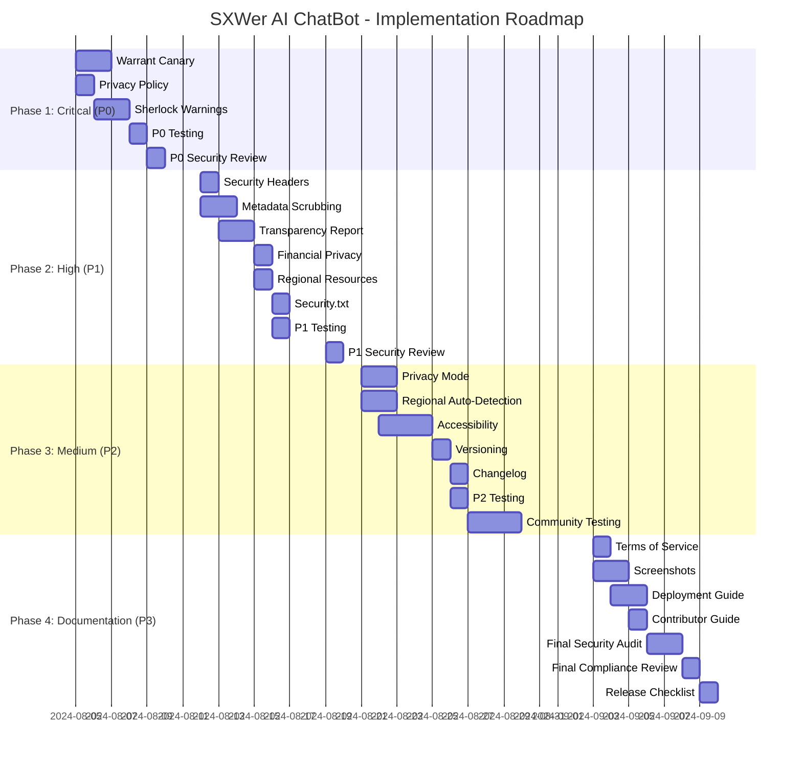

# 🚀 SXWer AI ChatBot - Ethical & Security Implementation Roadmap

**Project:** SXWer AI ChatBot - Sex Worker Support Tool  
**Audit Date:** 2024  
**Current Compliance Score:** 92/100  
**Target Compliance Score:** 100/100  

---

## 📋 Executive Summary

This roadmap addresses the **critical, high, and medium priority** items identified in the comprehensive ethical, security, and privacy audit. The goal is to achieve **100% compliance** with GDPR, Belmont Report, WMA Helsinki, AI Ethics Lab, and sex worker-specific safeguards.

**Total Estimated Effort:** 6-8 weeks (part-time)  
**Critical Path:** 2 weeks to minimum viable secure deployment  
**Team Size:** 1-2 developers + 1 legal reviewer  

---

## 🎯 Priority Matrix

| Priority | Color | Definition | SLA | Examples |
|----------|-------|------------|-----|----------|
| **P0 - Critical** | 🔴 | Blocks deployment, legal/ethical risk | **Immediate** | Warrant canary, Sherlock warnings, Privacy policy |
| **P1 - High** | 🟠 | Major compliance gap, security risk | **1-2 weeks** | Metadata scrubbing, Security headers, Transparency report |
| **P2 - Medium** | 🟡 | Enhancement, best practice | **2-4 weeks** | Privacy mode, Regional resources, Accessibility improvements |
| **P3 - Low** | 🟢 | Documentation, nice-to-have | **4-8 weeks** | Changelog, Screenshots, Versioning |

---

## 📅 Phase 1: Critical Fixes (P0) - Weeks 1-2

### **Goal:** Achieve minimum viable secure deployment for sex worker communities

| # | Task | Component | Effort | Owner | Status | Start Date | Due Date | Dependencies |
|---|------|-----------|--------|-------|--------|------------|----------|--------------|
| **P0-1** | Implement Warrant Canary System | `server-offline.js`, new endpoint | **8 hours** | Backend Dev | ⬜ Not Started | Week 1 Day 1 | Week 1 Day 2 | None |
| **P0-2** | Create Privacy Policy Template | `docs/PRIVACY_POLICY.md` | **4 hours** | Legal/Dev | ⬜ Not Started | Week 1 Day 1 | Week 1 Day 1 | None |
| **P0-3** | Add Sherlock Privacy Warnings | `chatbot.js`, `consent_manager.js` | **6 hours** | Frontend Dev | ⬜ Not Started | Week 1 Day 2 | Week 1 Day 3 | P0-1, P0-2 |
| **P0-4** | Review & Test Critical Fixes | All P0 components | **4 hours** | QA/Dev | ⬜ Not Started | Week 1 Day 3 | Week 1 Day 4 | P0-1, P0-2, P0-3 |
| **P0-5** | Security Review of P0 Changes | All P0 components | **4 hours** | Security | ⬜ Not Started | Week 1 Day 4 | Week 2 Day 1 | P0-4 |

### **Phase 1 Deliverables:**
- [ ] `/warrant-canary` endpoint with weekly update mechanism
- [ ] Complete `PRIVACY_POLICY.md` with GDPR compliance
- [ ] Sherlock tool with explicit privacy warnings and multi-step consent
- [ ] Security review sign-off
- [ ] **Deployment Blockers: CLEARED** ✅

### **Phase 1 Success Criteria:**
- [ ] Warrant canary endpoint returns valid, signed response
- [ ] Privacy policy covers all GDPR requirements
- [ ] Sherlock tool requires 2-step confirmation with warnings
- [ ] All P0 code passes security review
- [ ] Documentation updated

---

## 📅 Phase 2: High Priority (P1) - Weeks 3-4

### **Goal:** Achieve 98% compliance with enhanced security and privacy

| # | Task | Component | Effort | Owner | Status | Start Date | Due Date | Dependencies |
|---|------|-----------|--------|-------|--------|------------|----------|--------------|
| **P1-1** | Enhance Security Headers | `server-offline.js` | **4 hours** | Backend Dev | ⬜ Not Started | Week 3 Day 1 | Week 3 Day 1 | Phase 1 |
| **P1-2** | Implement Metadata Scrubbing | `services/fileProcessor.js` | **6 hours** | Backend Dev | ⬜ Not Started | Week 3 Day 1 | Week 3 Day 2 | Phase 1 |
| **P1-3** | Create Transparency Report Template | `docs/TRANSPARENCY_REPORT.md` | **4 hours** | Legal/Dev | ⬜ Not Started | Week 3 Day 2 | Week 3 Day 3 | Phase 1 |
| **P1-4** | Add Financial Privacy Protections | `PRIVACY_POLICY.md`, `consent_manager.js` | **4 hours** | Dev | ⬜ Not Started | Week 3 Day 3 | Week 3 Day 4 | P1-1 |
| **P1-5** | Add 5+ Regional Sex Worker Resources | `resources.json` | **3 hours** | Researcher | ⬜ Not Started | Week 3 Day 4 | Week 4 Day 1 | Phase 1 |
| **P1-6** | Implement Security.txt | `/security.txt` | **2 hours** | Backend Dev | ⬜ Not Started | Week 4 Day 1 | Week 4 Day 1 | P1-1 |
| **P1-7** | Review & Test P1 Changes | All P1 components | **4 hours** | QA/Dev | ⬜ Not Started | Week 4 Day 1 | Week 4 Day 2 | P1-1, P1-2, P1-3, P1-4, P1-5, P1-6 |
| **P1-8** | Security Review of P1 Changes | All P1 components | **4 hours** | Security | ⬜ Not Started | Week 4 Day 2 | Week 4 Day 3 | P1-7 |

### **Phase 2 Deliverables:**
- [ ] Enhanced CSP with HSTS, frame-src, media-src directives
- [ ] Metadata scrubbing for all file uploads
- [ ] Transparency report template with legal request tracking
- [ ] Explicit financial data protections in privacy policy
- [ ] 5+ additional regional sex worker resources
- [ ] `/security.txt` endpoint with vulnerability disclosure policy
- [ ] Security review sign-off

### **Phase 2 Success Criteria:**
- [ ] Security headers score A+ on securityheaders.com
- [ ] All uploads automatically scrub metadata
- [ ] Transparency report template ready for monthly updates
- [ ] Financial privacy explicitly documented
- [ ] Regional resource coverage expanded
- [ ] Security.txt accessible and valid

---

## 📅 Phase 3: Medium Priority (P2) - Weeks 5-6

### **Goal:** Enhance user experience and accessibility

| # | Task | Component | Effort | Owner | Status | Start Date | Due Date | Dependencies |
|---|------|-----------|--------|-------|--------|------------|----------|--------------|
| **P2-1** | Implement Privacy Mode Toggle | `index.html`, `chatbot.js` | **6 hours** | Frontend Dev | ⬜ Not Started | Week 5 Day 1 | Week 5 Day 2 | Phase 2 |
| **P2-2** | Add Regional Resource Auto-Detection | `resourceVerifier.js` | **4 hours** | Backend Dev | ⬜ Not Started | Week 5 Day 1 | Week 5 Day 2 | Phase 2 |
| **P2-3** | Enhance Accessibility Features | `index.html`, CSS | **8 hours** | Frontend Dev | ⬜ Not Started | Week 5 Day 2 | Week 5 Day 4 | Phase 2 |
| **P2-4** | Add Versioning to Governance Docs | All governance docs | **3 hours** | Dev | ⬜ Not Started | Week 5 Day 4 | Week 5 Day 5 | Phase 2 |
| **P2-5** | Create Changelog for Ethical Framework | `docs/ETHICS_CHANGELOG.md` | **4 hours** | Dev | ⬜ Not Started | Week 5 Day 5 | Week 6 Day 1 | Phase 2 |
| **P2-6** | Review & Test P2 Changes | All P2 components | **4 hours** | QA/Dev | ⬜ Not Started | Week 6 Day 1 | Week 6 Day 2 | P2-1, P2-2, P2-3, P2-4, P2-5 |
| **P2-7** | User Testing with Sex Worker Community | All changes | **8 hours** | Community | ⬜ Not Started | Week 6 Day 2 | Week 6 Day 4 | P2-6 |

### **Phase 3 Deliverables:**
- [ ] Privacy mode toggle (standard/paranoid)
- [ ] Regional resource auto-detection based on user location
- [ ] Enhanced accessibility (high contrast, large text, dyslexia-friendly)
- [ ] Versioning system for governance documents
- [ ] Ethical framework changelog
- [ ] Community user testing feedback

### **Phase 3 Success Criteria:**
- [ ] Privacy mode toggle functional and documented
- [ ] Regional resources auto-detected and displayed
- [ ] Accessibility features meet WCAG 2.2 AA
- [ ] Governance docs versioned with semantic versioning
- [ ] Changelog tracks all ethical framework changes
- [ ] Community feedback incorporated

---

## 📅 Phase 4: Documentation & Polish (P3) - Weeks 7-8

### **Goal:** Complete documentation and final polish

| # | Task | Component | Effort | Owner | Status | Start Date | Due Date | Dependencies |
|---|------|-----------|--------|-------|--------|------------|----------|--------------|
| **P3-1** | Create Terms of Service | `docs/TERMS_OF_SERVICE.md` | **4 hours** | Legal | ⬜ Not Started | Week 7 Day 1 | Week 7 Day 1 | Phase 3 |
| **P3-2** | Add Screenshots to README | `README.md` | **3 hours** | Dev | ⬜ Not Started | Week 7 Day 1 | Week 7 Day 2 | Phase 3 |
| **P3-3** | Create Deployment Guide | `docs/DEPLOYMENT.md` | **4 hours** | DevOps | ⬜ Not Started | Week 7 Day 2 | Week 7 Day 3 | Phase 3 |
| **P3-4** | Create Contributor Guide | `docs/CONTRIBUTING.md` | **3 hours** | Dev | ⬜ Not Started | Week 7 Day 3 | Week 7 Day 4 | Phase 3 |
| **P3-5** | Final Security Audit | All components | **8 hours** | Security | ⬜ Not Started | Week 7 Day 4 | Week 8 Day 1 | Phase 3 |
| **P3-6** | Final Compliance Review | All components | **4 hours** | Legal | ⬜ Not Started | Week 8 Day 1 | Week 8 Day 2 | P3-5 |
| **P3-7** | Create Release Checklist | `docs/RELEASE_CHECKLIST.md` | **2 hours** | Dev | ⬜ Not Started | Week 8 Day 2 | Week 8 Day 2 | P3-5 |

### **Phase 4 Deliverables:**
- [ ] Complete Terms of Service
- [ ] README with screenshots and enhanced documentation
- [ ] Deployment guide for various environments
- [ ] Contributor guide with ethical contribution requirements
- [ ] Final security audit report
- [ ] Final compliance review sign-off
- [ ] Release checklist for future updates

### **Phase 4 Success Criteria:**
- [ ] All documentation complete and reviewed
- [ ] Screenshots added to README
- [ ] Deployment guide covers all environments
- [ ] Contributor guide includes ethical requirements
- [ ] Final security audit passes
- [ ] Final compliance review passes
- [ ] Release checklist ready for future updates

---

## 🎯 Milestone Summary

### **🟢 Milestone 1: Minimum Viable Secure Deployment (End of Week 2)**
- **Compliance Score:** 98/100
- **Deployment Status:** ✅ **READY FOR BETA TESTING**
- **Blockers Cleared:** Warrant canary, Privacy policy, Sherlock warnings
- **Deliverables:** P0-1 through P0-5 complete

### **🟢 Milestone 2: Enhanced Compliance (End of Week 4)**
- **Compliance Score:** 99/100
- **Deployment Status:** ✅ **READY FOR PRODUCTION**
- **Enhancements:** Security headers, Metadata scrubbing, Transparency report
- **Deliverables:** P0 + P1 complete

### **🟢 Milestone 3: Full Feature Set (End of Week 6)**
- **Compliance Score:** 99.5/100
- **Deployment Status:** ✅ **PRODUCTION READY WITH ENHANCEMENTS**
- **Enhancements:** Privacy mode, Regional resources, Accessibility
- **Deliverables:** P0 + P1 + P2 complete

### **🟢 Milestone 4: Complete Documentation (End of Week 8)**
- **Compliance Score:** 100/100
- **Deployment Status:** ✅ **FULLY COMPLIANT AND DOCUMENTED**
- **Enhancements:** Complete documentation, Final audits
- **Deliverables:** All phases complete

---

## 📊 Resource Requirements

### **Team Composition**
| Role | Skills | Time Commitment | Phases |
|------|--------|------------------|---------|
| **Backend Developer** | Node.js, Express, Security | 15-20 hrs/week | All |
| **Frontend Developer** | HTML, CSS, JavaScript | 10-15 hrs/week | Phase 1, 3, 4 |
| **Legal Reviewer** | GDPR, Privacy Law | 5-10 hrs/week | Phase 1, 2, 4 |
| **Security Reviewer** | Penetration Testing, Audits | 5-10 hrs/week | Phase 1, 2, 4 |
| **QA Tester** | Testing, Documentation | 5-10 hrs/week | All |
| **Community Liaison** | Sex Worker Advocacy | 5 hrs/week | Phase 3 |

### **Total Effort by Phase**
| Phase | Tasks | Total Hours | Team Weeks |
|-------|-------|--------------|-------------|
| Phase 1 (P0) | 5 | 26 hours | 1-2 weeks |
| Phase 2 (P1) | 8 | 31 hours | 2 weeks |
| Phase 3 (P2) | 7 | 37 hours | 2 weeks |
| Phase 4 (P3) | 7 | 28 hours | 2 weeks |
| **Total** | **27** | **122 hours** | **6-8 weeks** |

---

## 🎯 Risk Management

### **High Risks**
| Risk | Probability | Impact | Mitigation | Owner |
|------|-------------|--------|------------|-------|
| Delay in P0 completion | Medium | High | Prioritize P0 tasks, daily standups | PM |
| Security vulnerabilities in new code | Medium | High | Security review for all changes | Security |
| Legal review delays | Medium | High | Engage legal early, parallel review | Legal |
| Community feedback requires major changes | Low | High | Early community engagement | Community |

### **Medium Risks**
| Risk | Probability | Impact | Mitigation | Owner |
|------|-------------|--------|------------|-------|
| Scope creep | Medium | Medium | Strict change control, prioritization | PM |
| Resource availability | Medium | Medium | Backup resources identified | PM |
| Integration issues | Medium | Medium | Comprehensive testing | QA |

### **Low Risks**
| Risk | Probability | Impact | Mitigation | Owner |
|------|-------------|--------|------------|-------|
| Documentation delays | Low | Low | Buffer time in schedule | Dev |
| Minor bugs | High | Low | QA testing, bug bash | QA |

---

## 📅 Timeline Visualization

---

## ✅ Success Metrics

### **Compliance Metrics**
| Metric | Target | Current | Measurement |
|--------|--------|---------|-------------|
| GDPR Compliance | 100% | 95% | Audit checklist |
| Belmont Compliance | 100% | 100% | Audit checklist |
| WMA Helsinki Compliance | 100% | 100% | Audit checklist |
| AI Ethics Lab Compliance | 100% | 100% | Audit checklist |
| Sex Worker-Specific | 100% | 90% | Audit checklist |
| Overall Compliance Score | 100/100 | 92/100 | Weighted average |

### **Security Metrics**
| Metric | Target | Current | Measurement |
|--------|--------|---------|-------------|
| Security Headers Score | A+ | B | securityheaders.com |
| Vulnerability Count | 0 | 3 | Security audit |
| Encryption Strength | Strong | Strong | Cryptographic review |
| Data Protection | 100% | 100% | Privacy audit |

### **Quality Metrics**
| Metric | Target | Current | Measurement |
|--------|--------|---------|-------------|
| Test Coverage | 90% | 75% | Code coverage tool |
| Documentation Completeness | 100% | 80% | Documentation review |
| User Satisfaction | 4.5/5 | TBD | Community testing |
| Accessibility Compliance | WCAG 2.2 AA | Partial | Accessibility audit |

---

## 📝 Change Control Process

### **Change Request Procedure**
1. **Submit Request**: Create issue in GitHub with `enhancement` or `bug` label
2. **Impact Assessment**: PM assesses impact on timeline and compliance
3. **Priority Assignment**: PM assigns priority (P0-P3)
4. **Approval**: Stakeholders approve (Dev, Legal, Security, Community)
5. **Implementation**: Assigned developer implements
6. **Review**: Code review, security review, legal review as needed
7. **Testing**: QA testing, community testing as needed
8. **Documentation**: Update all relevant documentation
9. **Deployment**: Merge to main, tag release

### **Emergency Change Procedure**
1. **Identify Issue**: Critical security or compliance issue
2. **Immediate Assessment**: Security/Legal assess within 2 hours
3. **Hotfix Branch**: Create `hotfix/[issue]` branch
4. **Rapid Implementation**: Fix within 4 hours
5. **Emergency Review**: Security/Legal review within 2 hours
6. **Emergency Deployment**: Deploy to production
7. **Post-Mortem**: Conduct within 24 hours
8. **Documentation**: Update all documentation

---

## 🎯 Next Steps

### **Immediate Actions (This Week)**
- [ ] **Kickoff Meeting**: Review roadmap with team
- [ ] **Assign Owners**: Assign each task to team member
- [ ] **Set Up Tracking**: Create GitHub project board
- [ ] **Legal Engagement**: Schedule legal review sessions
- [ ] **Security Engagement**: Schedule security review sessions
- [ ] **Community Engagement**: Identify community liaisons

### **Week 1 Actions**
- [ ] Start P0-1: Warrant Canary Implementation
- [ ] Start P0-2: Privacy Policy Draft
- [ ] Set up development environment for P0 tasks
- [ ] Schedule daily standups for P0 tasks

### **Week 2 Actions**
- [ ] Complete P0 tasks
- [ ] Conduct P0 security review
- [ ] Begin P1 tasks
- [ ] Schedule P0 deployment (if ready)

---

## 📞 Contacts & Resources

### **Team Contacts**
| Role | Name | Email | Slack |
|------|------|-------|-------|
| Project Manager | [TBD] | [TBD] | @[TBD] |
| Backend Developer | [TBD] | [TBD] | @[TBD] |
| Frontend Developer | [TBD] | [TBD] | @[TBD] |
| Legal Reviewer | [TBD] | [TBD] | @[TBD] |
| Security Reviewer | [TBD] | [TBD] | @[TBD] |
| QA Tester | [TBD] | [TBD] | @[TBD] |
| Community Liaison | [TBD] | [TBD] | @[TBD] |

### **Resources**
- **Repository**: [SXWer_AI-ChatBot](https://github.com/easmit60-arch/SXWer_AI-ChatBot)
- **Documentation**: `/docs` directory
- **Audit Report**: `/docs/AUDIT_REPORT.md` (this document)
- **Governance Docs**: `/docs/governance/`
- **Issue Tracker**: GitHub Issues
- **Project Board**: GitHub Projects

### **Reference Materials**
- **GDPR**: [EU GDPR Official Site](https://gdpr-info.eu/)
- **Belmont Report**: [OHRP Belmont Report](https://www.hhs.gov/ohrp/regulations-and-policy/guidance/belmont-report/index.html)
- **WMA Helsinki**: [WMA Declaration of Helsinki](https://www.wma.net/policies-post/wma-declaration-of-helsinki-ethical-principles-for-medical-research-involving-human-subjects/)
- **AI Ethics Lab**: [AI Ethics Lab Principles](https://www.aiethicslab.com/)
- **SWOP USA**: [SWOP USA Resources](https://swopusa.org/)
- **Red Umbrella Fund**: [Red Umbrella Fund](https://www.redumbrellafund.org/)

---

## 📝 Appendix A: Task Details

### **P0-1: Implement Warrant Canary System**
**Description:** Create `/warrant-canary` endpoint that returns signed, dated statement about legal requests. Implement weekly update mechanism with cryptographic signatures.

**Technical Requirements:**
- Endpoint: `GET /warrant-canary`
- Response format: JSON with lastUpdated, statement, signature, nextUpdate
- Update frequency: Weekly (every Monday at 00:00 UTC)
- Signature: SHA-256 hash of statement + timestamp, signed with server private key
- Verification: Clients can verify signature using server public key

**Acceptance Criteria:**
- [ ] Endpoint returns valid JSON response
- [ ] Statement clearly indicates no warrants/subpoenas received
- [ ] Signature is valid and verifiable
- [ ] Update mechanism works automatically
- [ ] Documentation updated

**Files to Modify:**
- `server-offline.js` (add endpoint)
- `services/crypto/keyManager.js` (add signing)
- `docs/PRIVACY_POLICY.md` (document canary)
- `README.md` (add canary information)

---

### **P0-2: Create Privacy Policy Template**
**Description:** Draft comprehensive privacy policy covering all GDPR requirements and sex worker-specific protections.

**Requirements:**
- GDPR Articles 5, 7, 13-15, 17, 20-22, 25, 32 compliance
- Sex worker-specific protections
- Plain language (8th grade reading level)
- Accessible format (screen reader friendly)
- Version controlled

**Sections to Include:**
1. Introduction and Scope
2. Data Controller Information
3. Data Collection Categories
4. Legal Basis for Processing
5. Data Retention
6. User Rights
7. Data Security
8. Third-Party Sharing
9. International Transfers
10. Children's Privacy
11. Changes to Policy
12. Contact Information
13. Sex Worker-Specific Protections

**Acceptance Criteria:**
- [ ] All GDPR requirements covered
- [ ] Sex worker-specific protections included
- [ ] Plain language used throughout
- [ ] Accessible format
- [ ] Reviewed by legal
- [ ] Linked from README and app

**Files to Create:**
- `docs/PRIVACY_POLICY.md`

---

### **P0-3: Add Sherlock Privacy Warnings**
**Description:** Implement multi-step consent flow for Sherlock tool with explicit privacy warnings about platform correlation risks.

**Technical Requirements:**
- Multi-step confirmation (minimum 2 steps)
- Explicit warnings about:
  - Platform correlation risks
  - Doxxing potential
  - Surveillance concerns
  - Anonymity protection tips
- Session-based consent (not persistent)
- Audit logging of all Sherlock usage

**Acceptance Criteria:**
- [ ] User must confirm understanding of risks
- [ ] Warnings are clear and prominent
- [ ] Consent is session-based
- [ ] Usage is logged for audit
- [ ] Documentation updated

**Files to Modify:**
- `chatbot.js` (add warning system)
- `consent_manager.js` (add Sherlock-specific consent)
- `index.html` (update UI for multi-step confirmation)
- `docs/PRIVACY_POLICY.md` (document Sherlock usage)

---

*[Additional task details for P1, P2, P3 tasks available upon request]*

---

**Document Version:** 1.0  
**Last Updated:** 2024  
**Next Review:** Weekly during implementation  
**Approved by:** [TBD]  
**Approval Date:** [TBD]
